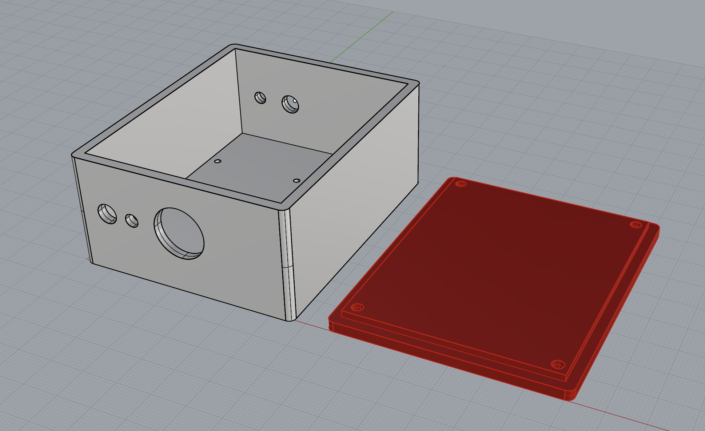
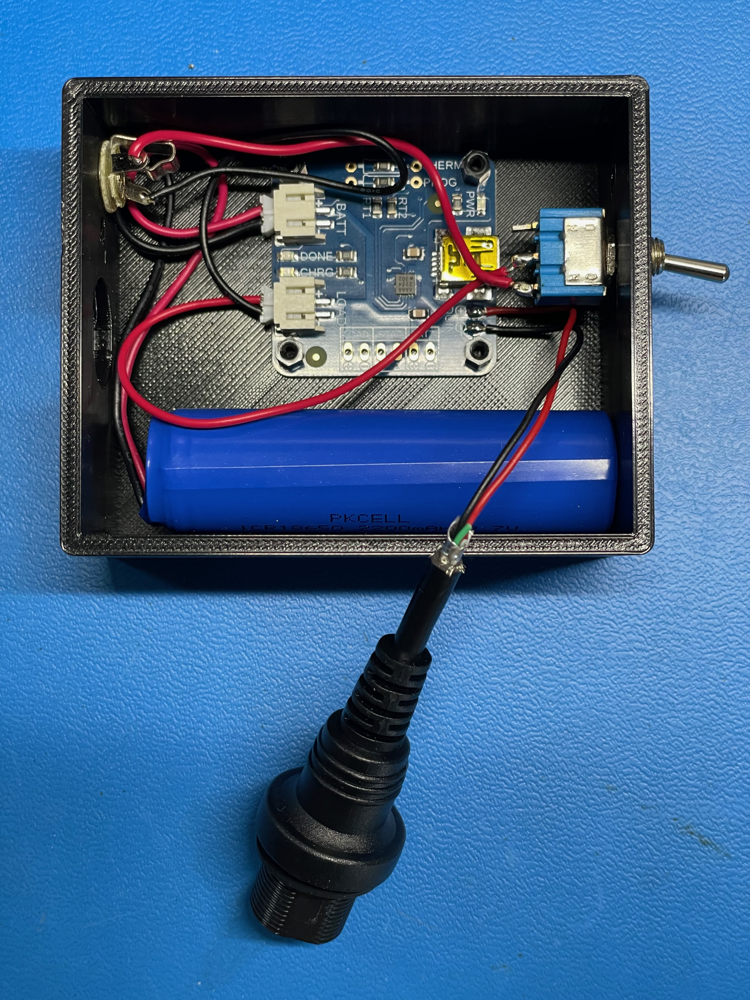

# Dart Board Toe Line: Rechargable Power Supply for a Diode Line Laser

Do you like throwing darts? I wasted many a good evening in college throwing darts, shooting pool, and drinking beer. I have a dart board in the hallway outside
the bedrooms in our home, and I wasn't happy with the cheap products sold for projecting a laser line on the floor, so I thought I'd make my own. Fun fact, the 
dart throwing line is called the *toe line* or *oche*. I found a few different green laser line diodes that seem bright enough for a hallway. But these lasers draw 
a decent amount of current, 50-100 mA depending on the specific laser's power output, so I thought a high capacity rechargeable battery would be a good idea for 
powering the laser. This simple project is the build out and parts list. Here's what the laser looks like installed. (Ignore that black horizontal box next to 
the laser...that's a cheap red laser dart line I bought on Amazon. It's a pain to align, and it gets bumped out of place frequently.)

## Finished Product

This looks boring, I know. it's a box with tethered laser.

But wait! The inside is more interesting:

There's a lot more going on here than you might expect, so let me break it down.

## Assembly Information

This project consists of the following parts

* 3D printed housing
* AdaFruit [2200 mAh Li-ion battery](https://www.adafruit.com/product/1781)
* AdaFruit [USB Li-ion battery charger](https://www.adafruit.com/product/259)
* [USB panel mounted jack](https://www.amazon.com/dp/B082J1BL6H)
* 1/8 TS jack
* [1/8 TS cable](https://www.amazon.com/gp/product/B0749HMSJL?th=1)
* toggle switch
* AdaFruit [fiber optic light pipe](https://www.adafruit.com/product/4163)
* 5 mW green laser diode with line lens (more info coming)
* Laser diode mount (more info coming)

I wanted to have a proper charging circuit, and I wanted the laser itself to be detachable from the supply, so I could move the supply to my office to recharge it 
without having to take the laser off the wall. Here's a clearer look at the guts partially assembled.

The charging board has 3 LEDs on it. One to indicate power when USB is plugged in (red), and two more to indicate charging status (amber for charging and green for charged). 

I got the bright idea to use a light pipe to bring these status LEDs to the ouside of the housing. You can see the light pipes circled in the picture below.

This turned out to be a bit of pain. I had to glue gun the pipes in place, and the inner core of the pipe tended to push out of the outer core when flexed at an angle, which made the inner core stick
out of the side of the housing. Also, in the process of gluing, I messed up one side and had to pull the glue out. This ripped off the surface mount power LED, which I swapped out. That's why the 
power LED in the pictures below is blue instead of red. Stiil, the effect is nice, since we need to be able to see if the battery is charged. Note that if you don't want to bother with a light pipe, 
an easier approach would be panel mounted LEDs using the STAT header on the charging board. See the schematic for more info.

I also wanted a more durable way to provide USB recharging than some of my previous projects. Often with projects like this, I mount the circuit board with the USB jack on the edge of the housing
and then put a cut out in the housing to plug in the USB cable. That's fine for some projects, but because I was using light pipes, I needed to position the circuit board in the center of the box. So I found the panel mount USB plug listed in the parts list. These plugs are impressive and durable. Definitely overkill for this proejct. 

A final note. If you look at the schematic of the charging circuit, you'll see that the power LED is tied to the 5V USB input. So if you want a power LED that lights up when you switch the load on,
you'll need to wire that up separately. Also, while they're labeled "BATT" and "LOAD", either plug can be used for the battery and load. They're just wired together. This does mean that when you're
charging the battery, you should have your load switched off unless you want the charging current to be shared between the load and the battery.

The charging circuit has a couple of features to consider. 1) You can change the default charging current by soldering a resistor onto the board. 2) If you have high-current draw applications, you can 
also attach a thermistor to the board to monitor temperature. Neither of these applied to my use case.

